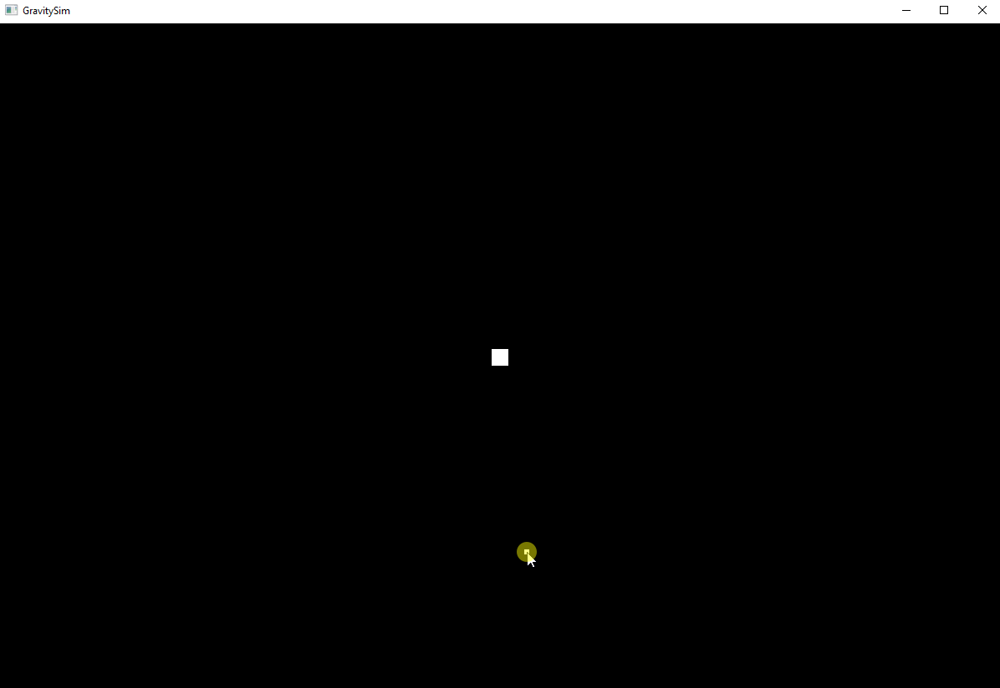

# GravitySim
2D n-body gravity simulator written in C++ w/ SDL

## Principles of Operation

GravitySim runs in two phases:

1. Setup
2. Run

The setup phase begins when the program is run, and allows the user to place particles to be included in the simulation as desired.  Click and drag functionality is included to assign initial velocities to particles.

The run phase executes a predetermined number of timesteps allowing the user to visualize the gravitational forces between all particles.
